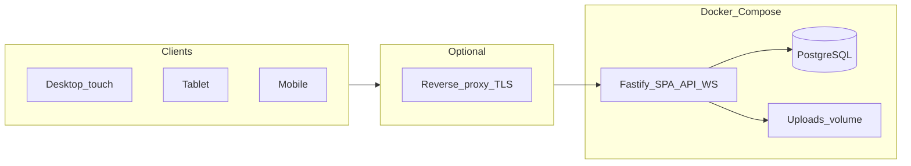

# Changeoverlord — product & engineering plan

This document captures the agreed **vision**, **architecture**, and **roadmap** for *Changeoverlord*: a web app for festival **sound crew** — schedules, **changeovers**, **riders** / **stage plots**, collaborative **input patch** and **RF**, and **stage clocks**. It is the canonical planning reference in-repo; keep it updated as decisions change.

**Documentation index:** [`README.md`](README.md) (all `docs/` files). **Operators:** [`USER_GUIDE.md`](USER_GUIDE.md). **Deploy:** [`README.md`](../README.md) in the repo root. **Feature requirements & competitive research:** [`FEATURE_REQUIREMENTS.md`](FEATURE_REQUIREMENTS.md).

**Powered by [Doug Hunt Sound & Light](https://www.doughunt.co.uk/).**

---

## 1. Product identity

| | |
|--|--|
| **Name** | **Changeoverlord** (distinct from generic “changeover” hospitality apps; stage-audio focused) |
| **Repository** | [github.com/doug86i/changeoverlord](https://github.com/doug86i/changeoverlord) |
| **Container image** | `ghcr.io/doug86i/changeoverlord/app` (tags: `latest`, semver on release) |

---

## 2. Goals

| Area | Direction |
|------|-----------|
| **Connectivity** | **v1**: **DHSL staff**, **offline-only** use (private LAN; no internet assumed at runtime). Same stack can be hosted online behind HTTPS later. |
| **Ease of deploy** | Non-IT staff: ideally **`docker compose up`** with **sensible defaults** in a **single [`docker-compose.yml`](../docker-compose.yml)**; optional **`.env`** only for infrastructure. |
| **Config split** | **Infrastructure** (paths, ports, image tag) in Compose / `.env`. **Product** behaviour (auth, **local** schedule times, riders, patch data, branding) in the **app UI**, not env toggles. |
| **Clients** | One **responsive** web app: **desktop** (incl. 32" touch), **tablet**, **mobile** — layouts tuned per form factor. |
| **Domain** | **Event → Stage(s) → Day schedule(s) → Performance(s)** with times, changeovers, uploads, collaborative patch/RF from **stage-level default templates**. |
| **Collaboration** | **Real-time** shared **modern spreadsheet** (cell grid, multi-sheet where needed, sensible keyboard/clipboard behaviour) for **input list + RF** — see **§6.1**. |
| **Media** | Upload riders and plots; **pick a PDF page** to extract when the plot is inside a multi-page rider. |
| **Clock** | **Server time** + countdown to next performance/changeover; **fullscreen** clock for stage displays. |
| **Branding** | **Client/event logo** configurable in-app; **fixed** “Powered by Doug Hunt Sound & Light” footer + bundled DHSL logo (offline-safe). |
| **Source / ship** | **Public GitHub** + **`docker-compose.yml`**; **`docker compose pull`** of pre-built **`app`** from **GHCR** — typical install needs **no local image build** (clone repo for compose + static bind-mounts). |
| **Prep off-site** | Events/stages/days can be **prepared on another machine** and moved to the **live** show server via a **downloadable package** and **upload** (no network between sites required). |

---

## 3. Recorded product decisions

| Topic | Decision |
|-------|----------|
| **Patch + RF** | **One spreadsheet per performance** (multi-sheet workbook: **Input**, **RF**, etc.); template prepared in-app and/or from **Excel / Google Sheets** (export → `.xlsx`). |
| **Desktop / large touch default** | **Day timeline / running order** (now/next, jump band) after choosing event + stage — not clock-first or patch-first |
| **Guest / kiosk / read-only URLs** | **Not MVP** — trusted LAN or optional password |
| **Print / PDF export** | **Defer** post-MVP |
| **Spreadsheet templates** | **Default “base”** for a stage can come from **Microsoft Excel** (`.xlsx`) and, for **Google Sheets**, by **exporting** to `.xlsx` or **CSV** and uploading (LAN/offline-safe). Optional **live Google Sheets** sync is a **post-MVP** track when internet + OAuth are acceptable. |
| **Portable event packages** | **MVP**: **Export** → **download** an archive; **import** via **upload** on another Changeoverlord instance (e.g. prep laptop → **USB** → live rig). **Future**: **push/pull** via **SeaDrive**, **Dropbox**, **Google Drive** (or similar) when online. |
| **Multi-person prep** | Different people may prepare **different events, stages, or days** on different machines — **export/import** is **granular** (separate packages per **event**, **stage**, or **stage-day** as needed). |
| **Auth** | **Default: no password** (trusted LAN). **Optional: single shared password** in Settings. |
| **Threat model** | If **no password**: assume **trusted environment**; still follow baseline web hygiene. Stricter defaults when password is on or host is **internet-facing** — see **[`DECISIONS.md`](DECISIONS.md)**. |
| **Limits** | **Generous** server maxima + clear user messages — avoid **“computer says no”** on stage; numbers in **[`DECISIONS.md`](DECISIONS.md)**. |
| **Browsers** | Current ±1 major **Chrome, Firefox, Safari, Edge**; no bleeding-edge-only APIs; see **[`DECISIONS.md`](DECISIONS.md)**. |
| **Logging** | **`LOG_LEVEL`** via **`.env` / Compose**; structured Pino + web `logDebug` — see **[`LOGGING.md`](LOGGING.md)** / **[`DECISIONS.md`](DECISIONS.md)**. |
| **Locale** | **English** only for MVP. |
| **Time** | Each **event = one location** — all **times are local event time** unless explicitly labelled otherwise (no multi-timezone complexity in v1). |
| **Accountability** | **Not required** for v1 (no per-user audit trail). |
| **Backups** | Operators use **external** backup of **`DATA_DIR`** (or host backups). **In-app manual backup/restore** is a **future** feature — not v1. |

**Detailed engineering choices** (IDs, API prefixes, Yjs storage, stack, migrations, E2E, load): **[`DECISIONS.md`](DECISIONS.md)**.

**Licences** (repo MIT vs alternatives, dependency GPL notes): **[`LICENSING.md`](LICENSING.md)**.

---

## 4. Deployment & operations

### 4.1 Distribution

- **Public GitHub** repo; **CI** (GitHub Actions) builds and pushes **`app`** to **GHCR** on pushes to **`main`** and on **version tags** (e.g. `v1.0.0`).
- **GHCR package** should stay **public** so `docker compose pull` works **without** `docker login` (aligned with a public repo).
- Typical install: **clone** repo → `docker compose pull` (when online once) → `docker compose up -d`.
- **Pinning**: use **`APP_IMAGE_TAG`** in `.env` (e.g. semver tag) for production festivals; **`latest`** is fine for dev.
- After images are cached, the **show site can run fully offline** on the LAN.
- **Air-gapped** installs: advanced — `docker save` / `docker load` of the same images; document when needed.

### 4.2 Single Compose file

- **One [`docker-compose.yml`](../docker-compose.yml)** for **Linux, macOS, and Windows** (Docker Desktop).
- Header documents **defaults** for: **`DATA_DIR`**, **`HOST_PORT`**, **`APP_IMAGE_TAG`**.
- The **`app`** image is a self-contained Node container serving the compiled SPA (`web/dist`) via **`@fastify/static`** and the API (`api/dist`) — no nginx or bind-mounts. Source changes require rebuilding the image (`make dev`).
- Deeper host-specific overrides only if needed: **`compose.override.example.yml`** pattern; prefer **`.env`** first.

### 4.3 Data on one host tree (`DATA_DIR`)

All durable state under one root (default **`./data`**) for **backup, browsing, and moving to a larger disk**:

| Path | Role |
|------|------|
| `data/db/` | PostgreSQL |
| `data/uploads/` | User uploads (template files, future riders/plots) |

See **[`data/README.md`](../data/README.md)**. Set **`DATA_DIR`** in **`.env`** (see **[`.env.example`](../.env.example)**) — use forward slashes; Windows examples included.

### 4.4 Ports

- Default **`HOST_PORT=80`** so users open `http://hostname` without `:port`.
- If 80 is busy or restricted (e.g. Windows), use **`HOST_PORT=8080`** in `.env`.

### 4.5 What stays outside the UI

Appropriate for Compose / host docs only: **port binding**, **TLS termination** in front of the stack, **`DATA_DIR` / host-level backups**, **firewall**. **In-app backup/restore** may arrive in a later version; v1 assumes **external** copies of the data tree or VM snapshots.

### 4.6 Deployment philosophy (non-IT summary)

- **v1 audience**: **Doug Hunt Sound & Light staff** on a **private LAN** — **offline** at show time (no reliance on internet for core operation).
- **Goal**: one command (**`docker compose up -d`**) with **no required** YAML or `.env` edits for a default LAN run.
- **Settings in the app** (not env): authentication mode, **local event time** display (see **§6**), clock behaviour, **how to sync host time** (NTP guidance), **public URL / trust** copy (for future online use), **template defaults** for new performances.
- **Sensible defaults**: open LAN or **first-run** password to DB; **offline-safe** UI assets (**no** runtime dependency on public CDNs for core flows).
- **Hardening**: internal Postgres/Redis passwords are **fixed on the Docker network** for LAN; document stricter secrets for internet-facing deployments.
- **Offline runtime**: bundle **fonts/icons** in the **`app`** image; LAN does not need GitHub or registry after images are cached.

---

## 5. Architecture (target)

**Redis** is not in the stack for v1; an in-process `EventEmitter` handles SSE pub/sub for the single-instance LAN deployment. Add **Redis pub/sub** (or Postgres `LISTEN/NOTIFY`) when multi-replica scaling or background job queues (e.g. PDF) are needed.

### Suggested stack (implementation)

| Layer | Direction |
|-------|-----------|
| API | **Node.js + TypeScript** (e.g. Fastify) — *or Python + FastAPI if preferred* |
| Real-time | **WebSockets** + **Yjs** (or **Automerge**) for CRDT spreadsheet state |
| Spreadsheet UI | **FortuneSheet** (or similar) for **modern** grid UX; **import** path from **ExcelJS**/SheetJS → seed **Yjs** / sheet state |
| DB | **PostgreSQL** — events, stages, days, performances, metadata, template links, file refs |
| Event packages | **Versioned zip** manifest + entity JSON/SQL dump + blob files + Yjs state; **import** validation |
| PDF | **`pdf-lib` / `pdf.js` / `pdftoppm` (poppler)** — thumbnails + extract chosen page → PDF/PNG beside uploads |
| Frontend | **Vite + React + TypeScript**, TanStack Query — SPA served fully from the LAN appliance |
| Styling | CSS modules or Tailwind; **three layout profiles** (lg/md/sm) with shared components |

**Alternative API**: **Python + FastAPI** is viable if the team prefers it; architecture stays the same.

---

## 6. Data model (core)

- **Event** — name, dates; **one location per event** — all schedule times stored and shown as **local event time** (optional explicit **IANA timezone** label later if needed; v1 assumes local-only semantics).
- **Stage** — belongs to event; **`default_patch_template`** (nullable = blank grid) — **cloned into each new performance** as that performance’s live workbook.
- **StageDay** — stage + calendar date (or day index); ordered **performances** and **changeover** blocks.
- **Performance** — start/end times (**local**), band name, notes; **attachments**; **one collaborative spreadsheet per performance** (multi-sheet: **Input**, **RF**, etc.) — **live Yjs doc id** + optional snapshot/history.
- **FileAsset** — local path under `uploads/` (or S3-compatible later); types e.g. `rider_pdf`, `plot_pdf`, `plot_image`, `extracted_page`.
- **Template** — **Yjs initial state** for the **stage default** workbook; **cloned** into each new **performance** (each performance then has its **own** live doc). Stage templates may be **authored in-app** or **seeded from an imported workbook** (see below).

### 6.1 Spreadsheet templates and import (Excel / Google Sheets)

**Goal**: Crews already work in **Excel** or **Google Sheets**; those feed the **stage default template**. Each **performance** gets **one** workbook (FortuneSheet): **multiple sheets** inside it (e.g. **`Input`**, **`RF`**) — patch and RF live in the same file, not separate apps.

| Source | MVP behaviour | Notes |
|--------|----------------|--------|
| **Excel (`.xlsx`)** | **Upload** when defining the **stage default template** (or edit equivalent structure **in-app**). Server imports workbook → **canonical model** → **Yjs** per performance. | **One `.xlsx` workbook** with named sheets (**`Input`**, **`RF`**, …). Use **[ExcelJS](https://github.com/exceljs/exceljs)** (MIT) unless licence review picks another parser. |
| **Google Sheets** | **Export** → **Excel (`.xlsx`)** or **CSV** while online, then **upload** to Changeoverlord like any Excel file. | **No Google API required** on the festival LAN; matches **offline-first** deployment. |
| **Google Sheets (live)** | **Post-MVP**: optional integration (**Google Sheets API** + OAuth) to **pull** or **periodically sync** a sheet when the server has **internet** and the org accepts Google access. | Not required for core festival-LAN use. |

**Frontend**: a **modern** spreadsheet component (e.g. **[FortuneSheet](https://github.com/ruilisi/fortune-sheet)** MIT, with **Op**/collab hooks) aligned with **Yjs** — or equivalent that supports **import** of parsed workbooks into its document model.

**Persistence**: imported content seeds the **stage template**; each **performance** clone stores **its own** Yjs state (optional **Postgres** blob of source `.xlsx` on the template for re-import).

### 6.2 Portable event packages (export / import between machines)

**Need**: Prepare **events / stages / days** (and related templates, attachments, collaborative doc snapshots) on a **different machine** (office laptop, rehearsal) and **transfer** to the **live** festival server **without** requiring both hosts on the same network.

#### MVP: download + upload

| Flow | Behaviour |
|------|-----------|
| **Export** | User selects **scope**: **whole event**, **one stage** (all days), or **one stage-day** — each is a **separate** export so different preparers can move **only their** event/stage/day. Server builds one **`.zip`** with: **manifest** (JSON), **entity dump** for that scope, **`uploads/`** files referenced, **Yjs snapshots** for performances in scope. User **downloads** through the browser. |
| **Transfer** | Physical **USB**, **AirDrop**, **email**, shared disk — anything that moves a file. |
| **Import** | On the **target** instance: **Upload** the archive → validate format/version → **always create new** records (**new UUIDs**) — no silent overwrite of existing prep. Operators **delete** outdated events/stages when replacing prep; optional future **“replace” wizard** is convenience only. |
| **Versioning** | Export format carries **schema version** so older packages can be migrated or rejected with a clear error. |

**Security (optional later)**: password-encrypted archive or detached checksum for tamper-evidence — not required for trusted crew LANs in v1.

#### Future: cloud folder sync (post-MVP)

| Direction | Idea |
|-----------|------|
| **SeaDrive / Seafile** | **Push** export to a team folder, or **pull** latest package on the live server when the host has **network** and credentials. Fits orgs already on **Seafile**. |
| **Dropbox / Google Drive** | Similar: **OAuth** or **app folder**, **background job** or manual “sync from cloud” button — only when **internet** is available; **not** a substitute for offline LAN show operation. |

These integrations are **additive**: the **file-based** export/import remains the **portable, offline-guaranteed** path.

---

## 7. UX notes

**Routes** (illustrative): e.g. `/stage`, `/clock`, `/patch` — one SPA, **breakpoint-specific** layouts (not three separate apps).

- **Desktop / 32" touch**: **Default home = day timeline / running order** (now/next, jump band); dense strip + **band list**; drill into **patch/RF** tabs; **glanceability** and large tap targets.
- **Tablet**: **Single primary panel** — default next performance patch sheet or clock; hamburger for schedule and files.
- **Mobile**: **Stacked** — search/jump band → patch/RF (read-mostly, edit on demand) → attachments.
- **Navigation**: Prev/next band, jump list, search (shared across form factors).
- **Clock**: **`GET /api/v1/time`** — server **local** clock for the host; schedule comparisons use **event local times** (see **§6**). Clients compute countdown to next **performance start** or **changeover end**. **`/clock`** route with **Fullscreen API**; optional **`/clock?stage=id`**; minimal chrome, large digits + next label.
- **NTP**: **Settings** shows **server time vs browser time**, drift warning, plain-language steps to enable **NTP on the host running Docker** (no NTP in Compose; optional **sidecar** only as advanced documentation).

---

## 8. PDF workflow (planned)

1. Upload PDF → store file → **page count** + **thumbnail sprites** or **on-demand** thumbnails.
2. UI: grid of pages → user selects page → **extract** to new asset (`plot_from_rider`) and attach to stage/performance.
3. **Original rider** stays immutable; extracted plot is a **derivative** for quick display on stage.

---

## 9. Settings & access (UI)

- **Modes** (DB-backed, toggled in Settings): **open** (trusted LAN), **shared password** (global or per-event later). **Per-user accounts / audit** — not v1 (see **§3**).
- **First-run**: optional wizard — “Set a password now” or “Continue without password” (**warn** on exposed networks).
- **No `AUTH_DISABLED`-style env**: access mode is visible and editable in the UI — operators should not hunt Compose env docs for auth.
- **Clock copy**, **server vs browser time** / NTP guidance — not env vars. **Event times** are **local** (see **§3**); optional timezone label is a future nicety.

---

## 10. Branding

- **Client / festival logo**: configurable in Settings (**per event** or deployment policy); use in **header**, optional **splash/login**, future **print/export**; **PNG/SVG** with safe-area preview.
- **Fixed attribution**: compact footer on layouts — **“Powered by Doug Hunt Sound & Light”** + logo → [doughunt.co.uk](https://www.doughunt.co.uk/). **Not removable** in normal OSS builds (white-label could be a separate product if ever needed).
- **Bundled assets**: ship DHSL logo(s) in the frontend bundle (e.g. `web/public/branding/dhsl-logo.svg`) — **no** reliance on live hotlinking for LAN/offline. Prefer a clean horizontal lockup from source art (avoid depending on arbitrary URLs from third-party sites).
- **Accessibility**: footer readable on **dark** and **light** themes.

**Visual design** (clean/modern, **two themes** — daylight + dark venue, **accent** from **DHSL** wordmark — industrial red, wide geometric caps as reference): **[`DESIGN.md`](DESIGN.md)**.

---

## 11. Reference products (inspiration only)

Not requirements — useful patterns and UX references.

| Product / area | Role | Ideas to borrow |
|----------------|------|-----------------|
| [Shoflo](https://shoflo.tv/) (Lasso) | Run-of-show | Timeline collaboration, time math, production **Docs**, roles, guest rundown access, “prompter”-style focused views ↔ our **fullscreen clock** |
| [Stage Portal](https://stageportal.gg/) | Gig/stage | Tech riders, run sheets, crew roles, shared updates |
| [RoadOps](https://roadops.app/) | Tour/festival hub | Offline-friendly flows, day sheets, activity feeds, visibility |
| Crescat / FestivalPro | Festival-wide ops | Multi-day scheduling, advancing — often heavier than **one stage audio** team needs |
| Shure WWB, RF Venue, RFCoordinator | RF desktop tools | Coordination math / scans — we store **RF notes** in-grid; deep device integration **optional** |

**Patterns worth borrowing later**: change **activity** (who edited what), read-only **guest** links, **print/PDF** day sheet, **notifications** when online, **templates** per show type.

---

## 12. Post-MVP backlog (non-binding)

Current priorities: **no guest/kiosk in MVP**; **print/PDF deferred**. Detailed requirements with user-journey analysis and competitive research: **[`FEATURE_REQUIREMENTS.md`](FEATURE_REQUIREMENTS.md)**.

| Idea | Notes |
|------|--------|
| **Print / PDF export** | Day sheet or plot + times — revisit after core is stable |
| **Activity log** | Append-only schedule/patch history — **not required** for v1 |
| **Kiosk / guest mode** | Read-only URL — revisit if visiting engineers need it |
| **Light roles** | FOH / monitors / stage — same data, different default views |
| **PWA / service worker** | Faster reload on poor Wi‑Fi; server remains source of truth |
| **Contingency slots** | TBD acts without breaking the clock — **deferred** |
| **Stage notes** | Weather / intercom / SM notes per day (not the spreadsheet) |
| **Mic line / walk checklist** | Optional separate from patch grid |
| **SeaDrive / Dropbox / Google Drive** | **Push/pull** event packages or sync — see **§6.2** (future) |

---

## 13. Implementation phases (recommended order)

1. ~~Scaffold: repo, Compose, Postgres, Redis, placeholder app, CI → GHCR~~
2. **Settings + first-run** + server time API + operator docs
3. **CRUD**: events → stages → days → performances + file metadata
4. **Clock UI**: countdown, fullscreen, band navigation
5. **Collaborative grids**: **`.xlsx` import** as stage default template; clone per show, Yjs + WS, persistence
6. **PDF**: thumbnails + page extract
7. **Branding**: client logo + DHSL footer assets
8. **Portable packages**: **export** (download archive) + **import** (upload) for moving prep between machines
9. **Polish**: responsive layouts, touch; TLS/reverse-proxy doc for online hosting

---

## 14. Roadmap checklist (high level)

| ID | Track | Status |
|----|-------|--------|
| — | Compose + GHCR + `DATA_DIR` layout + single `docker-compose.yml` | **Done** |
| domain-api | Event → Stage → Day → Performance CRUD + file metadata API | **Done** (CRUD complete; `file_assets` table ready for future rider/plot uploads) |
| clock-ui | Server time API + countdown + fullscreen + band navigation | **Done** |
| collab-grids | Global template library, **import `.xlsx`**, create from presets, in-app editing, clone per performance, Yjs + WebSocket + persistence | **Done** |
| pdf-plots | PDF upload, extract page as derivative PDF, stage + performance attach | **Partial** (no raster thumbnails; page picker + **pdf-lib** extract) |
| responsive-ux | Desktop / tablet / mobile layouts; touch-first stage views | Pending |
| settings-ui | Settings: auth, passwords, template library management | **Done** (shared password + session cookie + template CRUD) |
| branding-ui | Client logo; fixed “Powered by DHSL” footer + bundled logo | **Partial** (DHSL footer done; client logo pending) |
| event-pack | **Export** / **import** event packages (zip + manifest + uploads + Yjs snapshots); conflict/version rules | Pending |

---

## 15. Maintaining this doc

- Edit **`docs/PLAN.md`** when scope or decisions change.
- Keep **[`README.md`](../README.md)** focused on **run** / **dev**; link here for **why** and **what’s next**.
- **Engineering decisions** (stack, IDs, limits, auth details): **[`DECISIONS.md`](DECISIONS.md)**.
- **Licencing**: **[`LICENSING.md`](LICENSING.md)**.
- **Repo layout**: clone the repo at **any path** on disk; application source will grow under e.g. **`api/`** and **`web/`** as implementation proceeds (not present in the initial scaffold).
