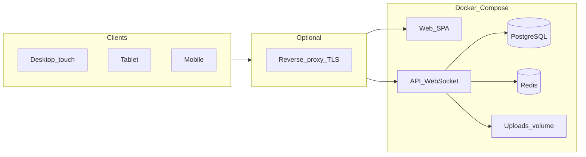

# Changeoverlord — product & engineering plan

This document captures the agreed **vision**, **architecture**, and **roadmap** for *Changeoverlord*: a web app for festival **sound crew** — schedules, **changeovers**, **riders** / **stage plots**, collaborative **input patch** and **RF**, and **stage clocks**. It is the canonical planning reference in-repo; keep it updated as decisions change.

**Powered by [Doug Hunt Sound & Light](https://www.doughunt.co.uk/).**

---

## 1. Product identity

| | |
|--|--|
| **Name** | **Changeoverlord** (distinct from generic “changeover” hospitality apps; stage-audio focused) |
| **Repository** | [github.com/doug86i/changeoverlord](https://github.com/doug86i/changeoverlord) |
| **Container image** | `ghcr.io/doug86i/changeoverlord/app` (tags: `latest`, semver on release) |

---

## 2. Goals

| Area | Direction |
|------|-----------|
| **Connectivity** | Primary: **LAN / offline** server at the show (no internet required at runtime). Same stack can be hosted online behind HTTPS. |
| **Ease of deploy** | Non-IT staff: ideally **`docker compose up`** with **sensible defaults** in a **single [`docker-compose.yml`](../docker-compose.yml)**; optional **`.env`** only for infrastructure. |
| **Config split** | **Infrastructure** (paths, ports, image tag) in Compose / `.env`. **Product** behaviour (auth, timezone, riders, patch data, branding) in the **app UI**, not env toggles. |
| **Clients** | One **responsive** web app: **desktop** (incl. 32" touch), **tablet**, **mobile** — layouts tuned per form factor. |
| **Domain** | **Event → Stage(s) → Day schedule(s) → Performance(s)** with times, changeovers, uploads, collaborative patch/RF from **stage-level default templates**. |
| **Collaboration** | **Real-time** shared **modern spreadsheet** (cell grid, multi-sheet where needed, sensible keyboard/clipboard behaviour) for **input list + RF** — see **§6.1**. |
| **Media** | Upload riders and plots; **pick a PDF page** to extract when the plot is inside a multi-page rider. |
| **Clock** | **Server time** + countdown to next performance/changeover; **fullscreen** clock for stage displays. |
| **Branding** | **Client/event logo** configurable in-app; **fixed** “Powered by Doug Hunt Sound & Light” footer + bundled DHSL logo (offline-safe). |
| **Source / ship** | **Public GitHub** + **`docker-compose.yml`**; **`docker compose pull`** of pre-built **`app`** from **GHCR** — typical install needs **no local image build** (clone repo for compose + static bind-mounts). |

---

## 3. Recorded product decisions

| Topic | Decision |
|-------|----------|
| **Patch + RF** | **One collaborative document** with **tabs: Input \| RF** |
| **Desktop / large touch default** | **Day timeline / running order** (now/next, jump band) after choosing event + stage — not clock-first or patch-first |
| **Guest / kiosk / read-only URLs** | **Not MVP** — trusted LAN or optional password |
| **Print / PDF export** | **Defer** post-MVP |
| **Spreadsheet templates** | **Default “base”** for a stage can come from **Microsoft Excel** (`.xlsx`) and, for **Google Sheets**, by **exporting** to `.xlsx` or **CSV** and uploading (LAN/offline-safe). Optional **live Google Sheets** sync is a **post-MVP** track when internet + OAuth are acceptable. |

---

## 4. Deployment & operations

### 4.1 Distribution

- **Public GitHub** repo; **CI** (GitHub Actions) builds and pushes **`app`** to **GHCR** on pushes to **`main`** and on **version tags** (e.g. `v1.0.0`).
- **GHCR package** should stay **public** so `docker compose pull` works **without** `docker login` (aligned with a public repo).
- Typical install: **clone** repo → `docker compose pull` (when online once) → `docker compose up -d`.
- **Pinning**: use **`APP_IMAGE_TAG`** in `.env` (e.g. semver tag) for production festivals; **`latest`** is fine for dev.
- After images are cached, the **show site can run fully offline** on the LAN.
- **Air-gapped** installs: advanced — `docker save` / `docker load` of the same images; document when needed.

### 4.2 Single Compose file

- **One [`docker-compose.yml`](../docker-compose.yml)** for **Linux, macOS, and Windows** (Docker Desktop).
- Header documents **defaults** for: **`DATA_DIR`**, **`HOST_PORT`**, **`APP_IMAGE_TAG`**.
- **Bind-mounts** for `docker/html/` and `docker/nginx/default.conf` so static edits are **live** without rebuild; **`develop.watch`** rebuilds when **`Dockerfile`** changes.
- Deeper host-specific overrides only if needed: **`compose.override.example.yml`** pattern; prefer **`.env`** first.

### 4.3 Data on one host tree (`DATA_DIR`)

All durable state under one root (default **`./data`**) for **backup, browsing, and moving to a larger disk**:

| Path | Role |
|------|------|
| `data/db/` | PostgreSQL |
| `data/redis/` | Redis (AOF) |
| `data/uploads/` | User uploads (riders, plots, logos) |

See **[`data/README.md`](../data/README.md)**. Set **`DATA_DIR`** in **`.env`** (see **[`.env.example`](../.env.example)**) — use forward slashes; Windows examples included.

### 4.4 Ports

- Default **`HOST_PORT=80`** so users open `http://hostname` without `:port`.
- If 80 is busy or restricted (e.g. Windows), use **`HOST_PORT=8080`** in `.env`.

### 4.5 What stays outside the UI

Appropriate for Compose / host docs only: **port binding**, **TLS termination** in front of the stack, **`DATA_DIR` backups**, **firewall**. Not product toggles.

### 4.6 Deployment philosophy (non-IT summary)

- **Goal**: one command (**`docker compose up -d`**) with **no required** YAML or `.env` edits for a default LAN run.
- **Settings in the app** (not env): authentication mode, **timezone**, clock behaviour, **how to sync host time** (NTP guidance), **public URL / trust** copy, **template defaults** for new performances.
- **Sensible defaults**: open LAN or **first-run** password to DB; **offline-safe** UI assets (**no** runtime dependency on public CDNs for core flows).
- **Hardening**: internal Postgres/Redis passwords are **fixed on the Docker network** for LAN; document stricter secrets for internet-facing deployments.
- **Offline runtime**: bundle **fonts/icons** in the **`app`** image; LAN does not need GitHub or registry after images are cached.

---

## 5. Architecture (target)

**Redis**: WebSocket adapter / pub-sub (per stage/performance), optional session store, optional job queue for PDF work.

### Suggested stack (implementation)

| Layer | Direction |
|-------|-----------|
| API | **Node.js + TypeScript** (e.g. Fastify) — *or Python + FastAPI if preferred* |
| Real-time | **WebSockets** + **Yjs** (or **Automerge**) for CRDT spreadsheet state |
| Spreadsheet UI | **FortuneSheet** (or similar) for **modern** grid UX; **import** path from **ExcelJS**/SheetJS → seed **Yjs** / sheet state |
| DB | **PostgreSQL** — events, stages, days, performances, metadata, template links, file refs |
| PDF | **`pdf-lib` / `pdf.js` / `pdftoppm` (poppler)** — thumbnails + extract chosen page → PDF/PNG beside uploads |
| Frontend | **Vite + React + TypeScript**, TanStack Query — SPA served fully from the LAN appliance |
| Styling | CSS modules or Tailwind; **three layout profiles** (lg/md/sm) with shared components |

**Alternative API**: **Python + FastAPI** is viable if the team prefers it; architecture stays the same.

---

## 6. Data model (core)

- **Event** — name, dates, timezone, optional **auth scope** (if multi-tenant later).
- **Stage** — belongs to event; **`default_patch_template_id`** (nullable = blank grid); **RF** shares the **same collaborative doc** as input (**tabs: Input \| RF**).
- **StageDay** — stage + calendar date (or day index); ordered **performances** and **changeover** blocks.
- **Performance** — start/end times, band name, notes; **attachments**; **live Yjs document id** (and optional **snapshot** table for history).
- **FileAsset** — local path under `uploads/` (or S3-compatible later); types e.g. `rider_pdf`, `plot_pdf`, `plot_image`, `extracted_page`.
- **Template** — **Yjs initial state** and/or **JSON schema** for rows/columns; **cloned** into each new performance from stage defaults. Templates may be **seeded from an imported workbook** (see below).

### 6.1 Spreadsheet templates and import (Excel / Google Sheets)

**Goal**: Crews already work in **Excel** or **Google Sheets**; Changeoverlord should accept those as the **starting point** for the **stage default template** (and blank in-app starter remains an option).

| Source | MVP behaviour | Notes |
|--------|----------------|--------|
| **Excel (`.xlsx`)** | **Upload** in Settings or when defining the stage default template. Server **imports** workbook structure and cell values into the app’s **canonical grid model** (then **Yjs** for live collaboration). | Prefer **one workbook** with clear sheet names (e.g. `Input`, `RF`) or a single sheet + tabs in-app — product detail TBD. Use a **well-maintained OSS parser** on the server (e.g. **[ExcelJS](https://github.com/exceljs/exceljs)** MIT, or **[SheetJS](https://sheetjs.com/)** community build — **verify license** for your use case). |
| **Google Sheets** | **Export** → **Excel (`.xlsx`)** or **CSV** while online, then **upload** to Changeoverlord like any Excel file. | **No Google API required** on the festival LAN; matches **offline-first** deployment. |
| **Google Sheets (live)** | **Post-MVP**: optional integration (**Google Sheets API** + OAuth) to **pull** or **periodically sync** a sheet when the server has **internet** and the org accepts Google access. | Not required for core festival-LAN use. |

**Frontend**: a **modern** spreadsheet component (e.g. **[FortuneSheet](https://github.com/ruilisi/fortune-sheet)** MIT, with **Op**/collab hooks) aligned with **Yjs** — or equivalent that supports **import** of parsed workbooks into its document model.

**Persistence**: imported content becomes the **initial Yjs snapshot** (and optional **Postgres** blob of source `.xlsx` for audit/re-import).

---

## 7. UX notes

**Routes** (illustrative): e.g. `/stage`, `/clock`, `/patch` — one SPA, **breakpoint-specific** layouts (not three separate apps).

- **Desktop / 32" touch**: **Default home = day timeline / running order** (now/next, jump band); dense strip + **band list**; drill into **patch/RF** tabs; **glanceability** and large tap targets.
- **Tablet**: **Single primary panel** — default next performance patch sheet or clock; hamburger for schedule and files.
- **Mobile**: **Stacked** — search/jump band → patch/RF (read-mostly, edit on demand) → attachments.
- **Navigation**: Prev/next band, jump list, search (shared across form factors).
- **Clock**: **`GET /api/time`** — UTC + optional `offsetMs` if leap-second handling is added later; clients compute countdown to next **performance start** or **changeover end**. **`/clock`** route with **Fullscreen API**; optional **`/clock?stage=id`**; minimal chrome, large digits + next label.
- **NTP**: **Settings** shows **server time vs browser time**, drift warning, plain-language steps to enable **NTP on the host running Docker** (no NTP in Compose; optional **sidecar** only as advanced documentation).

---

## 8. PDF workflow (planned)

1. Upload PDF → store file → **page count** + **thumbnail sprites** or **on-demand** thumbnails.
2. UI: grid of pages → user selects page → **extract** to new asset (`plot_from_rider`) and attach to stage/performance.
3. **Original rider** stays immutable; extracted plot is a **derivative** for quick display on stage.

---

## 9. Settings & access (UI)

- **Modes** (DB-backed, toggled in Settings): **open** (trusted LAN), **shared password** (global or per-event later), optional future **accounts** for audit.
- **First-run**: optional wizard — “Set a password now” or “Continue without password” (**warn** on exposed networks).
- **No `AUTH_DISABLED`-style env**: access mode is visible and editable in the UI — operators should not hunt Compose env docs for auth.
- **Timezone**, clock copy, **server vs browser time** / NTP guidance — not env vars.

---

## 10. Branding

- **Client / festival logo**: configurable in Settings (**per event** or deployment policy); use in **header**, optional **splash/login**, future **print/export**; **PNG/SVG** with safe-area preview.
- **Fixed attribution**: compact footer on layouts — **“Powered by Doug Hunt Sound & Light”** + logo → [doughunt.co.uk](https://www.doughunt.co.uk/). **Not removable** in normal OSS builds (white-label could be a separate product if ever needed).
- **Bundled assets**: ship DHSL logo(s) in the frontend bundle (e.g. `web/public/branding/dhsl-logo.svg`) — **no** reliance on live hotlinking for LAN/offline. Prefer a clean horizontal lockup from source art (avoid depending on arbitrary URLs from third-party sites).
- **Accessibility**: footer readable on **dark** stage theme (default) and **light** if added.

### Open styling default

- On-stage / backstage UI: default **dark, high-contrast** theme for **32"** displays (refinable).

---

## 11. Reference products (inspiration only)

Not requirements — useful patterns and UX references.

| Product / area | Role | Ideas to borrow |
|----------------|------|-----------------|
| [Shoflo](https://shoflo.tv/) (Lasso) | Run-of-show | Timeline collaboration, time math, production **Docs**, roles, guest rundown access, “prompter”-style focused views ↔ our **fullscreen clock** |
| [Stage Portal](https://stageportal.gg/) | Gig/stage | Tech riders, run sheets, crew roles, shared updates |
| [RoadOps](https://roadops.app/) | Tour/festival hub | Offline-friendly flows, day sheets, activity feeds, visibility |
| Crescat / FestivalPro | Festival-wide ops | Multi-day scheduling, advancing — often heavier than **one stage audio** team needs |
| Shure WWB, RF Venue, RFCoordinator | RF desktop tools | Coordination math / scans — we store **RF notes** in-grid; deep device integration **optional** |

**Patterns worth borrowing later**: change **activity** (who edited what), read-only **guest** links, **print/PDF** day sheet, **notifications** when online, **templates** per show type.

---

## 12. Post-MVP backlog (non-binding)

Current priorities: **no guest/kiosk in MVP**; **print/PDF deferred**.

| Idea | Notes |
|------|--------|
| **Print / PDF export** | Day sheet or plot + times — revisit after core is stable |
| **Activity log** | Append-only schedule/patch history (accountability) |
| **Kiosk / guest mode** | Read-only URL — revisit if visiting engineers need it |
| **Light roles** | FOH / monitors / stage — same data, different default views |
| **PWA / service worker** | Faster reload on poor Wi‑Fi; server remains source of truth |
| **Contingency slots** | TBD acts without breaking the clock |
| **Stage notes** | Weather / intercom / SM notes per day (not the spreadsheet) |
| **Mic line / walk checklist** | Optional separate from patch grid |

---

## 13. Implementation phases (recommended order)

1. ~~Scaffold: repo, Compose, Postgres, Redis, placeholder app, CI → GHCR~~
2. **Settings + first-run** + server time API + operator docs
3. **CRUD**: events → stages → days → performances + file metadata
4. **Clock UI**: countdown, fullscreen, band navigation
5. **Collaborative grids**: **`.xlsx` import** as stage default template; clone per show, Yjs + WS, persistence
6. **PDF**: thumbnails + page extract
7. **Branding**: client logo + DHSL footer assets
8. **Polish**: responsive layouts, touch; TLS/reverse-proxy doc for online hosting

---

## 14. Roadmap checklist (high level)

| ID | Track | Status |
|----|-------|--------|
| — | Compose + GHCR + `DATA_DIR` layout + single `docker-compose.yml` | **Done** |
| domain-api | Event → Stage → Day → Performance CRUD + file metadata API | Pending |
| clock-ui | Server time API + countdown + fullscreen + band navigation | Pending |
| collab-grids | Stage default templates (**Excel/Google-via-export** as base); clone per performance; **import `.xlsx`**; Yjs + WebSocket + persistence | Pending |
| pdf-plots | PDF upload, thumbnails, extract page as plot asset | Pending |
| responsive-ux | Desktop / tablet / mobile layouts; touch-first stage views | Pending |
| settings-ui | Settings: auth, passwords, timezone, time/NTP guidance (no ops in Compose) | Pending |
| branding-ui | Client logo; fixed “Powered by DHSL” footer + bundled logo | Pending |

---

## 15. Maintaining this doc

- Edit **`docs/PLAN.md`** when scope or decisions change.
- Keep **[`README.md`](../README.md)** focused on **run** / **dev**; link here for **why** and **what’s next**.
- **Repo layout**: clone the repo at **any path** on disk; application source will grow under e.g. **`api/`** and **`web/`** as implementation proceeds (not present in the initial scaffold).
