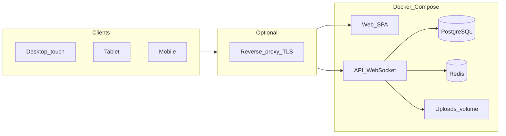

# Changeoverlord — product & engineering plan

This document captures the agreed **vision**, **architecture**, and **roadmap** for *Changeoverlord*: a web app for festival **sound crew** — schedules, **changeovers**, **riders** / **stage plots**, collaborative **input patch** and **RF**, and **stage clocks**. It is the canonical planning reference in-repo; keep it updated as decisions change.

**Powered by [Doug Hunt Sound & Light](https://www.doughunt.co.uk/).**

---

## 1. Product identity

| | |
|--|--|
| **Name** | **Changeoverlord** (distinct from generic “changeover” hospitality apps; stage-audio focused) |
| **Repository** | [github.com/doug86i/changeoverlord](https://github.com/doug86i/changeoverlord) |
| **Container image** | `ghcr.io/doug86i/changeoverlord/app` (tags: `latest`, semver on release) |

---

## 2. Goals

| Area | Direction |
|------|-----------|
| **Connectivity** | Primary: **LAN / offline** server at the show (no internet required at runtime). Same stack can be hosted online behind HTTPS. |
| **Ease of deploy** | Non-IT staff: ideally **`docker compose up`** with **sensible defaults** in a **single [`docker-compose.yml`](../docker-compose.yml)**; optional **`.env`** only for infrastructure. |
| **Config split** | **Infrastructure** (paths, ports, image tag) in Compose / `.env`. **Product** behaviour (auth, timezone, riders, patch data, branding) in the **app UI**, not env toggles. |
| **Clients** | One **responsive** web app: **desktop** (incl. 32" touch), **tablet**, **mobile** — layouts tuned per form factor. |
| **Domain** | **Event → Stage(s) → Day schedule(s) → Performance(s)** with times, changeovers, uploads, collaborative patch/RF from **stage-level default templates**. |
| **Collaboration** | **Real-time** shared spreadsheet for **input list + RF** (see stack). |
| **Media** | Upload riders and plots; **pick a PDF page** to extract when the plot is inside a multi-page rider. |
| **Clock** | **Server time** + countdown to next performance/changeover; **fullscreen** clock for stage displays. |
| **Branding** | **Client/event logo** configurable in-app; **fixed** “Powered by Doug Hunt Sound & Light” footer + bundled DHSL logo (offline-safe). |

---

## 3. Recorded product decisions

| Topic | Decision |
|-------|----------|
| **Patch + RF** | **One collaborative document** with **tabs: Input \| RF** |
| **Desktop / large touch default** | **Day timeline / running order** (now/next, jump band) after choosing event + stage — not clock-first or patch-first |
| **Guest / kiosk / read-only URLs** | **Not MVP** — trusted LAN or optional password |
| **Print / PDF export** | **Defer** post-MVP |

---

## 4. Deployment & operations

### 4.1 Distribution

- **Public GitHub** repo; **CI** (GitHub Actions) builds and pushes **`app`** to **GHCR**.
- Typical install: **clone** repo → `docker compose pull` (when online once) → `docker compose up -d`.
- After images are cached, the **show site can run fully offline** on the LAN.

### 4.2 Single Compose file

- **One [`docker-compose.yml`](../docker-compose.yml)** for **Linux, macOS, and Windows** (Docker Desktop).
- Header documents **defaults** for: **`DATA_DIR`**, **`HOST_PORT`**, **`APP_IMAGE_TAG`**.
- **Bind-mounts** for `docker/html/` and `docker/nginx/default.conf` so static edits are **live** without rebuild; **`develop.watch`** rebuilds when **`Dockerfile`** changes.
- Deeper host-specific overrides only if needed: **`compose.override.example.yml`** pattern; prefer **`.env`** first.

### 4.3 Data on one host tree (`DATA_DIR`)

All durable state under one root (default **`./data`**) for **backup, browsing, and moving to a larger disk**:

| Path | Role |
|------|------|
| `data/db/` | PostgreSQL |
| `data/redis/` | Redis (AOF) |
| `data/uploads/` | User uploads (riders, plots, logos) |

See **[`data/README.md`](../data/README.md)**. Set **`DATA_DIR`** in **`.env`** (see **[`.env.example`](../.env.example)**) — use forward slashes; Windows examples included.

### 4.4 Ports

- Default **`HOST_PORT=80`** so users open `http://hostname` without `:port`.
- If 80 is busy or restricted (e.g. Windows), use **`HOST_PORT=8080`** in `.env`.

### 4.5 What stays outside the UI

Appropriate for Compose / host docs only: **port binding**, **TLS termination** in front of the stack, **`DATA_DIR` backups**, **firewall**. Not product toggles.

---

## 5. Architecture (target)

**Redis**: WebSocket adapter / pub-sub (per stage/performance), optional session store, optional job queue for PDF work.

### Suggested stack (implementation)

| Layer | Direction |
|-------|-----------|
| API | **Node.js + TypeScript** (e.g. Fastify) — *or Python + FastAPI if preferred* |
| Real-time | **WebSockets** + **Yjs** (or similar CRDT) for collaborative grids |
| DB | **PostgreSQL** |
| PDF | Server-side thumbnails + page extract (`pdf-lib` / `pdfjs` / poppler as needed) |
| Frontend | **Vite + React + TypeScript**, TanStack Query |
| Styling | CSS modules or Tailwind; **three layout profiles** (lg/md/sm) |

---

## 6. Data model (core)

- **Event** — name, dates, timezone.
- **Stage** — belongs to event; **default template(s)** for new performances (blank or pre-built grid).
- **StageDay** — stage + calendar day; ordered **performances** and **changeover** blocks.
- **Performance** — times, act name, notes; attachments; **collaborative doc** (Yjs) for patch/RF.
- **FileAsset** — stored under `uploads/`; types e.g. rider PDF, plot, extracted page.
- **Templates** — initial grid structure; **cloned** into each new performance from stage defaults.

---

## 7. UX notes

- **Desktop / 32" touch**: Timeline + now/next + band list; drill into patch/RF tabs.
- **Tablet**: Focused panel (next act patch or clock); schedule/files secondary.
- **Mobile**: Jump to band → patch/RF → attachments.
- **Navigation**: Prev/next band, jump list, search.
- **Clock route**: e.g. `/clock` with **fullscreen**; **server time API** for countdowns.
- **NTP**: Explained in **Settings** (host OS sync); not a Compose setting.

---

## 8. PDF workflow (planned)

1. Upload PDF → page count + thumbnails.
2. User picks a page → **extract** as plot asset (original rider unchanged).

---

## 9. Settings & access (UI)

- Modes: **open LAN**, **shared password** (stored in DB), optional future accounts.
- **First-run**: optional wizard to set password or continue open (warn if exposed).
- **Timezone**, clock copy, **DHSL time-drift** help text in UI — not env vars.

---

## 10. Branding

- **Event/client logo**: upload in Settings (header / splash / future print).
- **Footer**: always **“Powered by Doug Hunt Sound & Light”** + logo → [doughunt.co.uk](https://www.doughunt.co.uk/); assets **bundled** in the app for offline.

---

## 11. Reference products (inspiration only)

[Shoflo](https://shoflo.tv/), [Stage Portal](https://stageportal.gg/), [RoadOps](https://roadops.app/), festival ops suites (Crescat, FestivalPro), RF tools (Wireless Workbench, RF Venue, etc.) — patterns for timelines, riders, collaboration; not feature requirements.

---

## 12. Post-MVP backlog (non-binding)

Activity log, guest read-only links, light roles (FOH/monitors), PWA, contingency slots, stage notes, mic walk checklist — **print/PDF** and **kiosk** explicitly deferred per decisions above.

---

## 13. Implementation phases (recommended order)

1. ~~Scaffold: repo, Compose, Postgres, Redis, placeholder app, CI → GHCR~~
2. **Settings + first-run** + server time API + operator docs
3. **CRUD**: events → stages → days → performances + file metadata
4. **Clock UI**: countdown, fullscreen, band navigation
5. **Collaborative grids**: templates, clone per show, Yjs + WS, persistence
6. **PDF**: thumbnails + page extract
7. **Branding**: client logo + DHSL footer assets
8. **Polish**: responsive layouts, touch; TLS/reverse-proxy doc for online hosting

---

## 14. Roadmap checklist (high level)

| Track | Status |
|-------|--------|
| Compose + GHCR + data layout | Done (see repo) |
| Domain API (events → performances) | Pending |
| Clock + fullscreen | Pending |
| Collaborative patch/RF (Yjs + WS) | Pending |
| PDF pipeline | Pending |
| Responsive UX (3 breakpoints) | Pending |
| Settings UI (auth, time, NTP copy) | Pending |
| Branding UI + bundled DHSL assets | Pending |

---

## 15. Maintaining this doc

- Edit **`docs/PLAN.md`** when scope or decisions change.
- Keep **[`README.md`](../README.md)** focused on **run** / **dev**; link here for **why** and **what’s next**.
